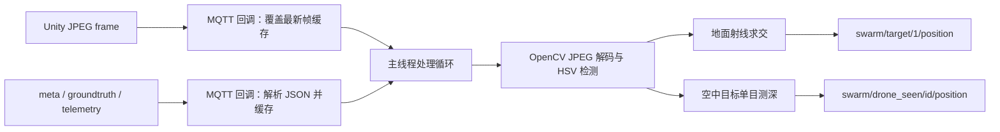

# 组 2 感知链路实现说明

## 1. 实现目标

本实现订阅 Unity 发布的 JPEG 相机帧、相机元数据、地面目标真值和无人机遥测，完成颜色目标检测与像素坐标到项目世界坐标的反解，并按组间约定发布感知位置。

接口约定来源：[组 2 感知任务](../groups/group2_perception.md)。本实现没有修改组 1、组 3 或组 4 已约定的 MQTT topic 和 JSON schema。

## 2. 交付文件

| 文件 | 作用 |
| --- | --- |
| `swarm/perception.py` | 不依赖 MQTT 的纯函数模块，负责相机几何、单目测深和 HSV 颜色块检测 |
| `scripts/sim_cam_perception.py` | MQTT 运行入口，负责缓存、解码、检测、反解、发布和误差统计 |
| `tests/test_perception.py` | 几何、视觉和无 broker 端到端 schema 测试 |
| `requirements.txt` | 增加 `opencv-python>=4.10` |

## 3. 数据流与线程模型



MQTT 回调不执行完整 OpenCV 处理。每架相机只保存一份最新 JPEG；新帧会直接覆盖旧帧，因此处理速度暂时下降时不会形成帧队列或持续增加延迟。主循环每 5 ms 检查一次缓存，在检测成功且输入保持组 1 约定的约 10 Hz 时，输出不会被主动限速到 5 Hz 以下。

## 4. 纯函数模块

### 4.1 相机内参

Unity 的 `Camera.fieldOfView` 是垂直视场角。设图像宽高为 `width`、`height`，垂直视场角为 `fov_deg`：

```text
fy = height / (2 * tan(fov / 2))
fx = fy
cx = width / 2
cy = height / 2
```

`camera_intrinsics()` 返回 `(fx, fy, cx, cy)`。实现假设方形像素，不额外引入水平 FOV 配置。

### 4.2 像素射线

相机坐标系定义为：

- x：图像右方；
- y：图像上方；
- z：相机前方。

像素 `(u, v)` 对应的未归一化射线为：

```text
[(u - cx) / fx, (cy - v) / fy, 1]
```

`pixel_to_ray()` 将其归一化为单位向量。因此中心像素对应 `[0, 0, 1]`。

### 4.3 相机射线到世界射线

项目坐标使用 `[x, y, z]`，z 向上。实现先归一化 `cam_forward_xyz`，再从 `cam_up_xyz` 中去除前向分量，以得到正交的上方向：

```text
forward = normalize(cam_forward)
up = normalize(cam_up - dot(cam_up, forward) * forward)
right = cross(forward, up)
world_ray = normalize(ray.x * right + ray.y * up + ray.z * forward)
```

这一步由 `ray_to_world()` 实现，并被地面反解和空中目标定位共同使用。

### 4.4 地面交点

`ray_to_ground()` 计算世界射线与 `z = ground_z` 平面的交点：

```text
t = (ground_z - cam_pos.z) / world_ray.z
position = cam_pos + t * world_ray
```

以下情况返回 `None`：

- 射线水平；
- 射线向上；
- 交点参数 `t < 0`，即交点位于相机后方；
- 相机坐标基无效时抛出输入错误，由运行入口安全跳过该帧。

### 4.5 单目测深

无人机已知渲染宽度为 `0.35 m`。包围盒像素宽度为 `pixel_width` 时：

```text
optical_depth = fx * 0.35 / pixel_width
```

`depth_from_apparent_size()` 返回沿相机光轴的深度。对于离轴像素，运行入口再用 `optical_depth / camera_ray.z` 换算沿单位射线的距离，最后与世界射线结合得到三维位置。

### 4.6 颜色块检测

`detect_color_blob()` 的处理步骤：

1. BGR 转 HSV；
2. 对一个或多个 HSV 范围生成掩膜，红色支持色相 0 附近的环绕区间；
3. 使用 3×3 开运算去除小噪点；
4. 使用 3×3 闭运算填补小孔洞；
5. 选择面积最大的有效外轮廓；
6. 返回 `((centroid_u, centroid_v), bounding_width, area)`；无有效轮廓时返回 `None`。

Unity `FallbackColor` 的对应关系为：

| ID 颜色索引 | 颜色 | OpenCV HSV 范围 |
| --- | --- | --- |
| 1 | 蓝 | H 95–120，S 80–255，V 60–255 |
| 2 | 红 | H 0–10 或 170–179，S 100–255，V 80–255 |
| 3 | 绿 | H 60–90，S 60–255，V 50–255 |
| 4 | 黄 | H 15–35，S 80–255，V 80–255 |

颜色按 `abs(drone_id - 1) % 4` 循环。相机自身 ID 会被排除；同一画面存在多个相同颜色的有效无人机 ID 时，实现选择跳过，避免把一个轮廓错误发布为多个身份。

## 5. MQTT 接口

### 5.1 订阅

| Topic | 内容 |
| --- | --- |
| `swarm/cam/drone/+/frame` | JPEG 原始字节 |
| `swarm/cam/drone/+/meta` | 相机内外参与位姿 |
| `swarm/target/1/groundtruth` | 地面目标真值，仅用于 `--validate` |
| `swarm/drone/+/telemetry` | 无人机 ID、活跃状态及验证真值 |

### 5.2 地面目标发布

Topic：`swarm/target/1/position`

```json
{
  "target": 1,
  "position": [3.0, -1.0, 0.0],
  "pixel": [320, 240],
  "source": "sim_cam",
  "camera_drone": 1,
  "timestamp_ms": 1720000000000
}
```

### 5.3 空中无人机发布

Topic：`swarm/drone_seen/{id}/position`

```json
{
  "target": 2,
  "position": [2.0, 1.0, 1.5],
  "pixel": [300, 180],
  "estimated_depth": 4.2,
  "source": "sim_cam",
  "camera_drone": 1,
  "timestamp_ms": 1720000000000
}
```

JSON 使用紧凑编码；QoS 默认 0；所有发布均设置 `retain=False`。

## 6. 时效与安全策略

| 数据 | 最大本地年龄 | 处理方式 |
| --- | --- | --- |
| JPEG frame | 0.5 秒 | 超时帧丢弃 |
| camera meta | 2.0 秒 | 缺失或超时则不处理对应帧 |
| groundtruth / telemetry | 2.0 秒 | 超时后不用于验证或无人机身份匹配 |

此外，meta 必须满足：

- topic 中相机 ID 与 `drone_id` 一致；
- `frame_id` 非负；
- 图像实际尺寸与 `width/height` 一致；
- `fov_deg` 和三个相机向量有效；
- meta 的绝对时间戳与处理时间相差不超过 5 秒；
- frame 与 meta 的本地接收时间相差不超过 2 秒。

meta 约 1 Hz、frame 约 10 Hz，因此不要求二者 `frame_id` 完全相等；一条新鲜 meta 可以服务随后多帧。

## 7. 运行方式

先启动 broker 和 Unity 相机发布端，再运行：

```bash
conda run -n eai-swarm python scripts/sim_cam_perception.py
```

完整参数示例：

```bash
conda run -n eai-swarm python scripts/sim_cam_perception.py \
  --host 127.0.0.1 \
  --port 1883 \
  --qos 0 \
  --validate \
  --save-frames logs/sim_cam
```

参数说明：

| 参数 | 默认值 | 说明 |
| --- | --- | --- |
| `--host` | `localhost` | MQTT broker 地址 |
| `--port` | `1883` | MQTT broker 端口 |
| `--qos` | `0` | 订阅和发布 QoS，可选 0、1、2 |
| `--validate` | 关闭 | 与 groundtruth/telemetry 比较误差 |
| `--save-frames [DIR]` | 关闭 | 每架相机每秒最多保存一张原始 JPEG；省略 DIR 时使用 `logs/sim_cam` |

## 8. 验证模式

`--validate` 为每个目标保留最近 100 个误差样本，每秒滚动输出：

- 样本数；
- 平均三维欧氏误差；
- 最大三维欧氏误差。

验证数据只参与统计，不会替代相机反解结果。

## 9. 测试

运行完整测试：

```bash
conda run -n eai-swarm python -m unittest discover -s tests
```

本次实现包含 7 项新增检查：

- 内参与中心像素射线；
- 已知位姿下的正投影/反投影往返；
- 下俯相机对前方地面点的反解；
- 水平和向上射线拒绝；
- 表观尺寸测深往返；
- 合成图像最大颜色块检测；
- 合成 JPEG + meta 经缓存、解码和反解后发布严格目标 schema。

提交前完整测试结果为 47 项通过。

## 10. Unity 联调事项

联合验收时需要重点确认：

1. Unity 实际发布的 `cam_forward_xyz`、`cam_up_xyz` 与项目 z 向上坐标约定一致；
2. Unity 时间戳为 Unix 毫秒，且 frame/meta 频率符合约 10 Hz / 1 Hz；
3. 实际光照、材质色彩空间和 JPEG 压缩下的 HSV 范围；
4. 红色地面目标与红色无人机的颜色歧义；
5. 四色循环下重复颜色无人机的身份关联；超过四个 ID 同屏时建议增加唯一视觉标记或时序跟踪；
6. `0.35 m` 渲染宽度与包围盒宽度的标定误差；
7. 地面目标平面误差是否小于 0.2 m，空中无人机三维误差是否小于 0.5 m。
